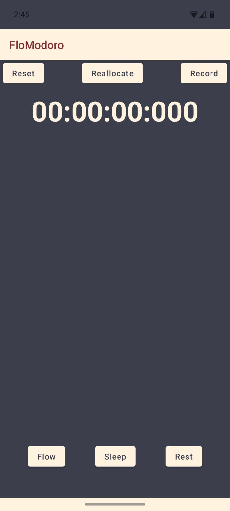

# FloModoro



FloModoro is an Android stopwatch application designed to help users enhance their productivity using the Flowmodoro technique. The Flowmodoro technique is a time management method that encourages focused work intervals followed by short breaks, promoting a balance between concentration and relaxation.

## Table of Contents

- [Introduction](#introduction)
- [Features](#features)
- [Installation](#installation)
- [Build](#building-and-running-locally)
- [License](#license)

## Features

- Android stopwatch application implementing the Flowmodoro technique.
- Easily export Flowmodoro sessions history to CSV files for data analytics.
- Created using Kotlin and Android Studio.

## Installation

1. Visit the [Releases section](https://github.com/Omar-Ebrahim-1/FloModoro/releases) of this repository.

2. Download the latest APK file from the available releases.

3. Install the APK on your Android device by following these steps:
   - Open the "Downloads" app or navigate to the folder where the APK is located.
   - Tap on the APK file.
   - If prompted, enable the "Install from unknown sources" option in your device settings.
   - Follow the on-screen instructions to complete the installation.

## Building and Running Locally

To build and run FloModoro locally, you'll need the following tools:

- Android Studio
- Kotlin SDK

1. Clone the repository:

    ```bash
    git clone https://github.com/Omar-Ebrahim-1/FloModoro.git
    ```

2. Open the project in Android Studio.

3. Build and run the application on an emulator or physical device.

Now, you have FloModoro running on your local environment!

## License

This project is licensed under the terms of the [GNU General Public License (GPL) version 3.0](LICENSE).

You can find a copy of the license in the [LICENSE](LICENSE) file included with this distribution.
